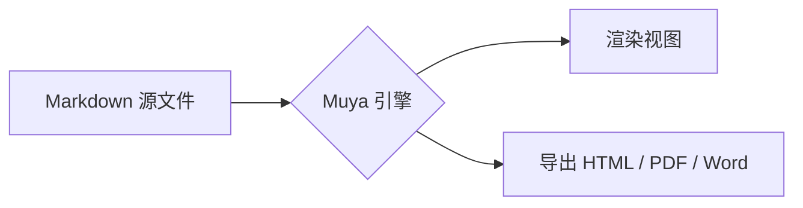

# 渲染能力示例

这份文档用于检查编辑器对常用 Markdown 语法的渲染结果：块标记在光标进入时显示、离开后折叠为排版结果。

支持 *斜体*、**加粗**、`行内代码`、~~删除线~~ 与 [链接](https://spec.commonmark.org)。

## 表格

| 能力 | 状态 | 实现方式 |
| :--- | :---: | :--- |
| 即时渲染 | 可用 | 同一引擎处理编辑与渲染 |
| 数学公式 | 可用 | KaTeX |
| 流程图 | 可用 | Mermaid |
| 导出 Word | 可用 | 调用 Pandoc |

## 数学公式

行内公式 $E = mc^2$，块级公式：

$$
\int_{-\infty}^{\infty} e^{-x^2}\,dx = \sqrt{\pi}
$$

## 流程图



## 代码块

```python
def fib(n: int) -> int:
    a, b = 0, 1
    for _ in range(n):
        a, b = b, a + b
    return a
```

## 任务列表

- [x] Windows 桌面端打包
- [x] Android 端打包
- [ ] 输入法与文件编码验证
- [ ] 大文档性能修复

> 引用块示例：桌面端与 Android 端共用同一套渲染引擎。
