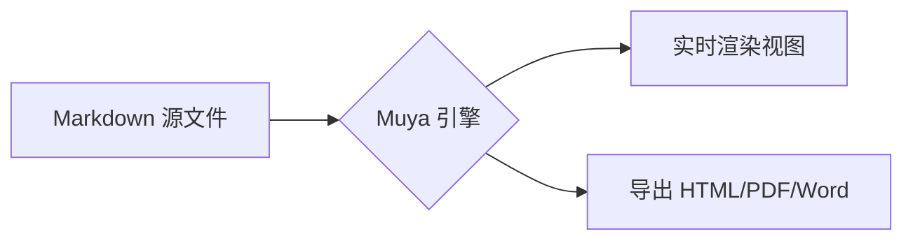

# InkMark 功能演示

这是一个用于验证 **Typora 式实时渲染** 的演示文档。支持 *斜体*、**加粗**、`行内代码`、~~删除线~~、[链接](https://spec.commonmark.org)。

## 表格

| 功能 | Typora | InkMark PoC | 说明 |
| :--- | :---: | :---: | :--- |
| 实时预览 | ✅ | ✅ | 同一引擎渲染 |
| 数学公式 | ✅ | ✅ | KaTeX |
| 流程图 | ✅ | ✅ | Mermaid |
| 导出 Word | ✅ | ✅ | 走 Pandoc |

## 数学公式

行内公式 $E = mc^2$，以及块级公式：

$$
\int_{-\infty}^{\infty} e^{-x^2}\,dx = \sqrt{\pi}
$$

## 流程图



## 代码块

```python
def fib(n: int) -> int:
    a, b = 0, 1
    for _ in range(n):
        a, b = b, a + b
    return a
```

## 任务列表

- [x] 桌面端打包（Windows x64）
- [x] 安卓端打包（APK 已签名）
- [ ] 麒麟 ARM64 构建
- [ ] 补 Typora 差距清单

> 引用块：免费、开源、跨平台，桌面与手机同一套渲染引擎。
