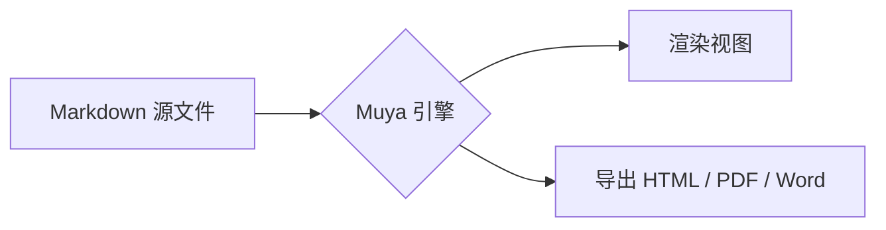

# 流程图与代码块示例



```javascript
function greet(name) {
  return `Hello, ${name}!`
}
console.log(greet('InkMark'))
```

- [x] Windows 桌面端打包
- [x] Android 端打包
- [ ] Linux arm64 构建
- [ ] 输入法验证

> 引用块示例：桌面端与 Android 端共用同一套渲染引擎。
