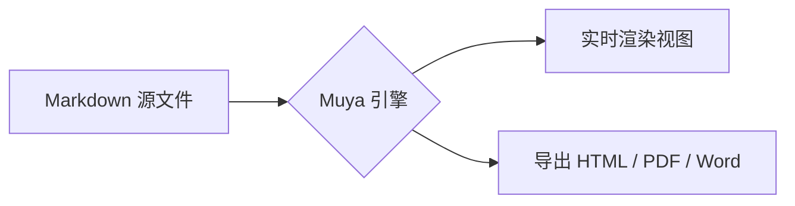

# Mermaid 与代码块验证



```javascript
function greet(name) {
  return `Hello, ${name}!`
}
console.log(greet('InkMark'))
```

- [x] 桌面端打包（Windows x64）
- [x] 安卓端打包（APK 已签名）
- [ ] 麒麟 ARM64 构建

> 引用块：桌面与手机共用同一套 Muya 渲染引擎。
